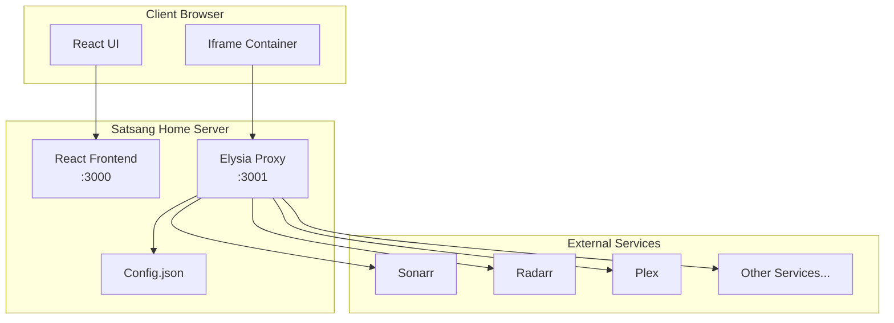

# Satsang Home - Architecture Document

## Project Overview

### Purpose
Satsang Home is a lightweight, self-hosted application organizer inspired by Organizr. It provides a unified interface for accessing multiple web services through a clean, tabbed interface with persistent iframe states.

### Key Differentiators
- **JSON-based configuration** - No complex UI for settings, just edit a simple JSON file
- **Bun/Elysia backend** - Leverages Bun's speed for proxy operations
- **Minimal complexity** - Focus on core functionality without feature bloat
- **Modern tech stack** - React Router v7, TypeScript, Bun

### Core Features
1. Persistent sidebar navigation
2. Service iframe embedding with state preservation
3. Proxy to bypass CORS/X-Frame-Options restrictions
4. Simple JSON configuration for services
5. Clean, responsive UI

## Technical Architecture

### Stack Overview
```
Frontend:
├── React Router v7 (SSR capable)
├── TypeScript
├── Vite (dev server)
└── CSS (minimal, no heavy frameworks)

Backend:
├── Bun runtime
├── Elysia web framework
├── Built-in proxy middleware
└── JSON file-based configuration

Deployment:
├── Docker support
└── Single container with both frontend and backend
```

### System Architecture



### Request Flow

1. **Initial Load**
   - User accesses Satsang Home
   - React app loads with sidebar from config
   - Default service or home page displays

2. **Service Selection**
   - User clicks service in sidebar
   - React updates active tab
   - Iframe loads: `/api/proxy/{service-id}`

3. **Proxy Flow**
   ```
   Browser Iframe Request → /api/proxy/sonarr
   ↓
   Elysia Proxy Handler
   ├── Validate service ID
   ├── Get service config (URL, auth)
   ├── Forward request to actual service
   ├── Strip security headers from response
   ├── Rewrite URLs in content
   └── Return modified response to iframe
   ```

## Component Architecture

### Frontend Components

```
app/
├── root.tsx                 # App shell with sidebar
├── components/
│   ├── Sidebar.tsx         # Service navigation
│   ├── ServiceFrame.tsx    # Iframe container
│   └── ConfigError.tsx     # Config validation errors
├── routes/
│   ├── _index.tsx          # Home/dashboard
│   └── service.$id.tsx     # Service iframe route
├── hooks/
│   ├── useConfig.ts        # Config loading
│   └── useServiceState.ts  # Frame state management
└── utils/
    └── proxyUrl.ts         # Proxy URL builder
```

### Backend Structure

```
server/
├── index.ts                # Elysia server entry
├── routes/
│   ├── proxy.ts           # Proxy handler
│   └── config.ts          # Config API endpoint
├── middleware/
│   ├── auth.ts            # Authentication handler
│   └── headers.ts         # Header manipulation
├── services/
│   ├── configLoader.ts    # JSON config management
│   ├── urlRewriter.ts     # URL rewriting logic
│   └── sessionManager.ts  # Per-service sessions
└── types/
    └── config.ts          # TypeScript definitions
```

## Configuration Schema

### config.json
```json
{
  "app": {
    "title": "Satsang Home",
    "theme": "dark",
    "defaultService": "home"
  },
  "services": [
    {
      "id": "sonarr",
      "name": "Sonarr",
      "url": "http://localhost:8989",
      "icon": "📺",
      "auth": {
        "type": "apikey",
        "header": "X-Api-Key",
        "value": "your-api-key"
      }
    },
    {
      "id": "radarr", 
      "name": "Radarr",
      "url": "http://localhost:7878",
      "icon": "🎬",
      "auth": {
        "type": "basic",
        "username": "admin",
        "password": "password"
      }
    },
    {
      "id": "plex",
      "name": "Plex",
      "url": "http://localhost:32400/web",
      "icon": "🎭",
      "auth": {
        "type": "none"
      }
    }
  ]
}
```

## API Design

### Proxy Endpoint
```
GET /api/proxy/:serviceId/*
POST /api/proxy/:serviceId/*
PUT /api/proxy/:serviceId/*
DELETE /api/proxy/:serviceId/*

Headers:
- X-Satsang-Service: {serviceId}
- X-Original-URL: {originalUrl}

Response Modifications:
- Remove: X-Frame-Options, Content-Security-Policy
- Add: X-Proxied-By: Satsang-Home
- Rewrite: URLs in HTML/CSS/JS content
```

### Config Endpoint
```
GET /api/config
Returns: Sanitized config (no auth secrets)

GET /api/config/validate
Returns: Config validation status
```

## Security Considerations

1. **Authentication**
   - Service credentials stored in config.json (server-side only)
   - No credentials exposed to frontend
   - Proxy injects auth headers server-side

2. **CORS & Headers**
   - Proxy strips restrictive headers
   - Adds permissive CORS headers for iframe
   - Preserves necessary cookies/sessions

3. **URL Validation**
   - Service URLs validated against whitelist
   - No arbitrary URL proxying
   - Path traversal protection

## Implementation Phases

### Phase 1: Core Infrastructure (Week 1)
- [x] Project setup with React Router v7
- [ ] Elysia server with basic proxy
- [ ] Config loading and validation
- [ ] Basic header stripping

### Phase 2: Frontend (Week 1-2)
- [ ] Sidebar component with service list
- [ ] Iframe container with basic loading
- [ ] Service switching without reload
- [ ] Basic styling and responsive layout

### Phase 3: Advanced Proxy (Week 2)
- [ ] URL rewriting in responses
- [ ] Authentication injection (API key, basic auth)
- [ ] Cookie/session management
- [ ] WebSocket proxying (stretch goal)

### Phase 4: Polish & Features (Week 3)
- [ ] Loading states and error handling
- [ ] Theme support (dark/light)
- [ ] Service health checks
- [ ] Docker containerization

### Phase 5: Extended Features (Future)
- [ ] Service search/filtering
- [ ] Custom CSS per service
- [ ] Bookmark specific service pages
- [ ] Multi-user support (stretch goal)

## Development Workflow

### Local Development
```bash
# Install dependencies
bun install

# Run development servers
bun run dev        # Frontend (Vite)
bun run server     # Backend (Elysia)

# Or run both
bun run dev:all
```

### Testing Approach
- Unit tests for proxy logic
- Integration tests for config loading
- E2E tests for service loading
- Manual testing with real services

### Deployment

#### Local Development
```bash
# Build for production
bun run build

# Run production server
bun run start
```

#### Production Deployment with Docker & Traefik

This application is designed to be deployed as a single Docker container behind Traefik, similar to how Organizr is deployed. The container includes both the React frontend and Elysia backend, making it easy to manage and update.

##### Docker Compose Example
```yaml
version: '3.8'

services:
  satsang-home:
    image: satsang-home:latest
    container_name: satsang-home
    restart: unless-stopped
    environment:
      - PORT=3000
      - PROXY_PORT=3001
      - CONFIG_PATH=/config/config.json
      - LOG_LEVEL=info
      - NODE_ENV=production
      - BASE_URL=https://home.yourdomain.com
      - ENABLE_AUTH=true
      - AUTH_SECRET=${AUTH_SECRET}
    volumes:
      - ./config:/config
      - ./data:/data  # For persistent storage if needed
    labels:
      # Traefik v2 labels
      - "traefik.enable=true"
      - "traefik.http.routers.satsang-home.rule=Host(`home.yourdomain.com`)"
      - "traefik.http.routers.satsang-home.entrypoints=websecure"
      - "traefik.http.routers.satsang-home.tls=true"
      - "traefik.http.routers.satsang-home.tls.certresolver=letsencrypt"
      - "traefik.http.services.satsang-home.loadbalancer.server.port=3000"
      # Security headers
      - "traefik.http.middlewares.satsang-home-headers.headers.frameDeny=false"
      - "traefik.http.middlewares.satsang-home-headers.headers.contentTypeNosniff=true"
      - "traefik.http.middlewares.satsang-home-headers.headers.browserXssFilter=true"
      - "traefik.http.routers.satsang-home.middlewares=satsang-home-headers"
    networks:
      - traefik-proxy

networks:
  traefik-proxy:
    external: true
```

##### Environment Variables
```bash
# Core Configuration
PORT=3000                           # Main app port
PROXY_PORT=3001                     # Elysia proxy server port
CONFIG_PATH=/config/config.json    # Path to config file
BASE_URL=https://home.example.com  # Public URL for the app

# Security
ENABLE_AUTH=true                    # Enable built-in authentication
AUTH_SECRET=<random-32-char>       # Secret for JWT/sessions
ALLOWED_ORIGINS=*                   # CORS origins (use specific domains in production)

# Performance
MAX_IFRAME_COUNT=10                 # Max concurrent iframes
PROXY_TIMEOUT=30000                 # Proxy timeout in ms
CACHE_DURATION=300                  # Cache duration in seconds

# Logging
LOG_LEVEL=info                      # debug, info, warn, error
ENABLE_METRICS=false                # Enable prometheus metrics

# Optional Features
ENABLE_HEALTH_CHECKS=true           # Enable service health monitoring
HEALTH_CHECK_INTERVAL=60            # Health check interval in seconds
```

##### Dockerfile Structure
```dockerfile
FROM oven/bun:1-alpine as builder

WORKDIR /app
COPY package.json bun.lockb ./
RUN bun install --frozen-lockfile

COPY . .
RUN bun run build

FROM oven/bun:1-alpine

WORKDIR /app
COPY --from=builder /app/build ./build
COPY --from=builder /app/server ./server
COPY --from=builder /app/package.json ./
COPY --from=builder /app/bun.lockb ./

RUN bun install --production --frozen-lockfile

EXPOSE 3000 3001

VOLUME ["/config", "/data"]

CMD ["bun", "run", "start"]
```

##### Deployment Steps
1. **Build the Docker image**:
   ```bash
   docker build -t satsang-home:latest .
   ```

2. **Create config volume**:
   ```bash
   mkdir -p ./satsang-home/config
   cp config.example.json ./satsang-home/config/config.json
   # Edit config.json with your services
   ```

3. **Deploy with docker-compose**:
   ```bash
   docker-compose up -d
   ```

4. **Update deployment**:
   ```bash
   docker pull satsang-home:latest
   docker-compose down
   docker-compose up -d
   ```

##### Traefik Integration Benefits
- **Automatic SSL**: Let's Encrypt certificates managed by Traefik
- **Single entry point**: All services behind one domain
- **Load balancing**: If scaling to multiple instances
- **Security headers**: Managed at proxy level
- **No port exposure**: Only Traefik needs external ports

##### Config Management
The configuration can be managed through:
1. **Volume mount**: Edit `config.json` directly on the host
2. **Environment overrides**: Key settings via ENV vars
3. **Config API**: Future feature for web-based config editing

This deployment model matches the simplicity of Organizr - single container, easy updates, and configuration through simple JSON files.

## Technical Decisions

### Why Bun/Elysia?
- **Performance**: Bun is significantly faster than Node.js
- **Built-in TypeScript**: No compilation step needed
- **Elysia**: Fast, type-safe, great DX
- **Smaller image size**: Bun runtime is compact

### Why React Router v7?
- Already in the project
- SSR capabilities if needed
- Good iframe route handling
- Modern React patterns

### Bun/Elysia vs React Router v7 Resource Routes

**RECOMMENDATION: Use Bun/Elysia for the proxy backend**

While React Router v7 offers resource routes that can handle backend logic, using Bun/Elysia as a separate backend service is the better choice for this project because:

1. **Separation of Concerns**: Keeping the proxy logic in a dedicated Elysia server separates frontend routing from backend proxy operations, making the codebase cleaner and more maintainable.

2. **Performance**: Bun's native performance advantages are best utilized in a dedicated service. Resource routes in RR7 would still run on Node.js in production, missing out on Bun's speed benefits for proxy operations.

3. **Proxy Complexity**: The proxy needs to handle header manipulation, URL rewriting, authentication injection, and potentially WebSocket upgrades. Elysia's middleware system is better suited for these complex proxy operations than RR7's resource routes.

4. **Scalability**: A separate backend service can be scaled independently from the frontend, deployed on different infrastructure, and optimized specifically for proxy workloads.

5. **Development Experience**: Elysia provides better TypeScript inference and dedicated proxy/HTTP utilities that would require more boilerplate in RR7 resource routes.

6. **Future Flexibility**: Having a dedicated API server makes it easier to add features like caching, rate limiting, metrics collection, and service health monitoring without cluttering the frontend codebase.

**When to consider RR7 resource routes**: Only if you want to minimize infrastructure complexity and have a single deployment unit. However, given this project's focus on proxying external services with authentication and header manipulation, the dedicated Elysia backend is the superior architectural choice.

### Why JSON Config?
- Simple to edit and version control
- No database needed
- Easy backup/restore
- Power users prefer text configs

### State Management
- React state for UI state
- Iframes naturally preserve their own state
- No complex state management needed
- Service states isolated in iframes

## Known Limitations

1. **WebSocket Services**: May require additional proxy logic
2. **File Downloads**: Large files through proxy may be slow
3. **Video Streaming**: May need range request support
4. **SSO**: Not implementing full SSO initially
5. **Mobile**: Iframes can be problematic on mobile

## Success Metrics

- [ ] Successfully proxy and display 5+ common services
- [ ] Page switches maintain iframe state
- [ ] < 100ms proxy overhead
- [ ] < 50MB Docker image
- [ ] Zero database requirements
- [ ] Single config file setup

## References

- [Organizr GitHub](https://github.com/causefx/Organizr)
- [Elysia Documentation](https://elysiajs.com)
- [Bun Documentation](https://bun.sh)
- [React Router v7](https://reactrouter.com)

---

*Last Updated: August 2024*
*Version: 1.0.0*